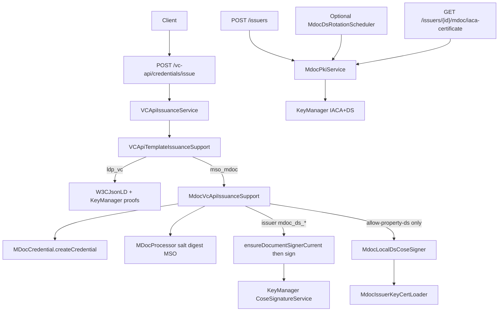

# VC API mDoc / mDL Support

Design and implementation notes for native `mso_mdoc` issuance on the W3C VC API path in Inji Certify — **without** the VCI plugin.

**Related:** [mDoc-IACA-Verifier-Trust.md](./mDoc-IACA-Verifier-Trust.md) — ISO verifier trust and IACA distribution.

---

## 1. Purpose

| Item | Description |
|------|-------------|
| **API** | `POST /v1/certify/vc-api/credentials/issue` |
| **Formats** | `ldp_vc` (existing) and `mso_mdoc` (this work) |
| **Auth** | API key (`X-API-Key`) |
| **Signing (mdoc)** | **Production:** issuer KeyManager Document Signer (`mdoc_ds_*`). **Non-prod only:** property DS when `mosip.certify.mdoc.allow-property-ds=true` |

Format is selected from the onboarded credential configuration’s `credentialFormat`. Clients do not send a separate format field.

---

## 2. Request / response

### Request (same shape for both formats)

```json
{
  "credentialSubject": {
    "id": "did:jwk:...",
    "family_name": "Doe",
    "given_name": "Jane"
  },
  "options": {
    "credentialConfigurationId": "mdl-config-id"
  }
}
```

For mdoc, `credentialSubject` is the **claims bag** matching Velocity placeholders in the onboarded `vcTemplate`. The holder device key should be supplied as `id` (`did:jwk:...`) when the MSO requires `deviceKeyInfo`.  
For `ldp_vc`, `id` is optional (no device-key binding required by this API).

### Response — `ldp_vc`

```json
{
  "format": "ldp_vc",
  "verifiableCredential": { "@context": ["..."], "type": ["..."], "proof": { } }
}
```

### Response — `mso_mdoc`

```json
{
  "format": "mso_mdoc",
  "verifiableCredential": "<base64url-encoded-cbor-IssuerSigned-mdoc>"
}
```

---

## 3. Document Signer configuration (VC API signing)

### Production (required)

1. Onboard the issuer (`POST /issuers` or default-issuer bootstrap) so KeyManager provisions IACA + DS.
2. Ensure the issuer row has `mdocDsAppId` / `mdocDsRefId`.
3. Keep:

```properties
# FAIL CLOSED — do not use property private keys in production
mosip.certify.mdoc.allow-property-ds=false
```

Signing path: `MdocVcApiIssuanceSupport` → `MDocProcessor.signMSO(appId, refId, ES256)` with `includeCertificate=true` (DS in COSE `x5chain`).

If `mdocDsAppId` is missing and property DS is disabled → error `mdoc_issuer_ds_not_configured`.

### Non-prod / local only

```properties
mosip.certify.mdoc.allow-property-ds=true
mosip.certify.mdoc.issuer-key-cert=${mosip.certify.mock.mdoc.issuer-key-cert:}
mosip.certify.mock.mdoc.issuer-key-cert=<base64PrivateKey>||<base64Certificate>
```

| Part | Encoding |
|------|----------|
| Private key | Base64 of PKCS#8 DER (EC P-256) |
| Certificate | Base64 of X.509 DER or PEM bytes |
| Separator | `\|\|` |

Generate material with [`deploy/inji-certify/mdoc.sh`](../deploy/inji-certify/mdoc.sh). Used only when issuer KeyManager DS refs are absent **and** `allow-property-ds=true`.

---

## 3b. IACA / DS KeyManager provisioning (issuer onboarding)

On `POST /issuers` (and default-issuer bootstrap), Certify provisions **per-issuer** mdoc PKI via KeyManager through `MdocPkiService`:

| Role | App ID | Ref ID | Validity (default) |
|------|--------|--------|--------------------|
| IACA | `CERTIFY_IACA_<ISSUER>` | `EC_SECP256R1_SIGN` | 20 years (`7300` days) |
| DS | `CERTIFY_DS_<ISSUER>` | `EC_SECP256R1_SIGN` | 2 years (`730` days) |

Flow: generate EC P-256 keys → rebuild IACA as self-signed CA → rebuild DS cert signed by IACA → `uploadCertificate`. Refs are stored on the `issuer` row (`mdoc_iaca_*`, `mdoc_ds_*`) and returned from onboarding/GET issuer APIs.

### Document Signer rotation (ROOT-style on demand)

Primary path: before each KeyManager DS sign, Certify calls `MdocPkiService.ensureDocumentSignerCurrent`.
If the DS cert is within `ds.key-policy.pre-expire-days` of `notAfter` (or already expired / unreadable), it force-rotates the DS key and re-signs the DS certificate with the existing IACA — same timing idea as KeyManager ROOT auto-rotate on use, but with mdoc IACA→DS cert rebuild.

Optional batch cron (off by default): set `mosip.certify.mdoc.ds.rotation.enabled=true` if you want proactive rotation with no issuance traffic.

```properties
mosip.certify.mdoc.iaca.key-policy.validity-days=7300
mosip.certify.mdoc.iaca.key-policy.pre-expire-days=90
mosip.certify.mdoc.ds.key-policy.validity-days=730
mosip.certify.mdoc.ds.key-policy.pre-expire-days=60
# optional proactive batch; default false — on-demand rotation during signing is primary
mosip.certify.mdoc.ds.rotation.enabled=false
mosip.certify.mdoc.ds.rotation.cron=0 0 2 * * *
```

### Export IACA for verifiers

```http
GET /v1/certify/issuers/{issuerId}/mdoc/iaca-certificate
```

Returns PEM in `certificateData`. Full verifier trust / distribution guide: [mDoc-IACA-Verifier-Trust.md](./mDoc-IACA-Verifier-Trust.md).

---

## 4. Architecture



### Classes

| Class | Role |
|-------|------|
| `VCApiTemplateIssuanceSupport` | Branches on `credentialFormat` |
| `MdocVcApiIssuanceSupport` | Template params, create unsigned mdoc, **on-demand DS rotate**, KeyManager (or property) sign, base64url |
| `MdocIssuerKeyCertLoader` | Parse property DS (non-prod only) |
| `MdocLocalDsCoseSigner` | COSE_Sign1 ES256 + unprotected `x5chain` (label 33) for property DS |
| `MDocProcessor.signMSO` | KeyManager COSE path used for issuer DS |
| `MDocProcessor.signMSOWithLocalDs` | Property DS overload |
| `MdocPkiService` | Provision / rotate IACA+DS; `ensureDocumentSignerCurrent`; export IACA PEM |
| `MdocDsRotationScheduler` | Optional batch DS rotation (disabled by default) |

### Processing order (mdoc)

1. Validate all non-system `vcTemplate` placeholders are present/non-blank in `credentialSubject`
2. Validate config is `mso_mdoc` with `docType`
3. Resolve template name via `CredentialCacheKeyGenerator`
4. Build template params (claims, `_doctype`, holder id, validity)
5. `MDocCredential.createCredential` (Velocity + `processTemplatedJson`)
6. Salt → digests → MSO
7. `ensureDocumentSignerCurrent` (rotate DS if near expiry) → Sign MSO with KeyManager DS (or non-prod property DS if allowed)
8. IssuerSigned structure → CBOR → base64url
9. Optional ledger metadata (no status-list for mdoc)

---

## 5. Production readiness / follow-up

### Closed in this work

- [x] Issue only via issuer KeyManager DS in production (`allow-property-ds=false` fail-closed)
- [x] Document ISO IACA distribution + export API for verifiers
- [x] DS rotation on demand (ROOT-style) during signing; cron optional / off by default

### Still follow-up

- Full ISO 18013-5 Annex B certificate profile (EKU `1.0.18013.5.1.2`, CRL DP, IssuerAltName, AKI, exact KeyUsage)
- IACA auto-rotation / link certificates
- Holder PoP on VC API for mdoc `deviceKey` (today: caller-trusted `did:jwk`)
- Interop verify with an external mdoc reader/wallet
- VCI plugin (`MDocMockVCIssuancePlugin`) alignment
- On-demand DS rotate for non–VC-API mdoc signing paths (`MDocCredential` / OID4VCI) if used

---

## 6. Errors

| Code | When |
|------|------|
| `missing_mandatory_claim` | `credentialSubject` missing a claim required by `vcTemplate` placeholders |
| `mdoc_issuer_ds_not_configured` | Issuer missing `mdocDsAppId` and property DS disabled |
| `mdoc_ds_key_not_configured` | Property DS empty (non-prod path) |
| `mdoc_ds_key_invalid` | Bad format / Base64 / key parse |
| `mdoc_local_cose_sign_failed` | COSE signing failure (property DS) |
| `mdoc_doctype_required` | Config missing `docType` |
| `unsupported_credential_format` | Format other than `ldp_vc` / `mso_mdoc` |
| `mdoc_pki_provisioning_failed` | IACA/DS KeyManager provisioning failed during onboarding |
| `mdoc_ds_rotation_failed` | Document Signer rotation failed |
| `mdoc_iaca_not_configured` | Cannot export IACA (missing refs / load failure) |
