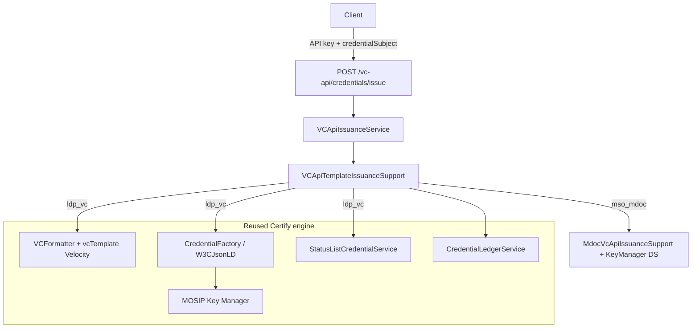
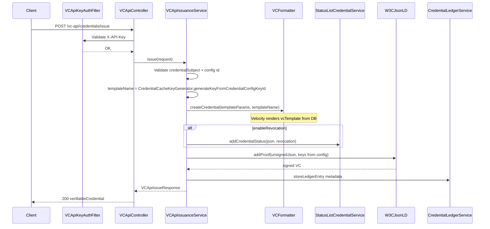

# W3C VC API Support — Client Credential Engine

Design document for adding a **parallel** W3C VC API issuance path in Inji Certify.  

---

## 1. Purpose

| Item | Description |
|------|-------------|
| **Consumer** | Client (server-to-server) |
| **Role of Certify** | Credential **signing engine** for Client |
| **Input** | **Credential body** (`credentialSubject` claims) + `credentialConfigurationId` — VC built via existing **`vcTemplate`** (Velocity) |
| **Output** | Signed `verifiableCredential` |
| **Auth** | API key (no eSignet / OAuth for this API) |

---

## 2. API surface

| Method | Path | Auth |
|--------|------|------|
| `POST` | `/v1/certify/vc-api/credentials/issue` | API key header |

**Feature flag:** `mosip.certify.vc-api.enabled=false` (default off)

### 2.1 Request payload — credential body + existing `vcTemplate` (chosen design)

Client sends **only the credential body** (claims). Certify **does not duplicate** template JSON — it reuses the **`vcTemplate`** already stored in `credential_config` and rendered by **`VelocityTemplatingEngineImpl`**.

| Who provides | What |
|--------------|------|
| **Client** | `credentialSubject` fields (claim values matching template placeholders) |
| **Credential config** (already onboarded) | `vcTemplate`, `@context`, `type`, `didUrl`, signing keys |
| **Certify** | Velocity render → optional status list → `addProof` → ledger |


#### Request contract (v1)

```http
POST /v1/certify/vc-api/credentials/issue
X-API-Key: <secret>
Content-Type: application/json
```

```json
{
  "credentialSubject": {
    "id": "did:example:holder",
    "fullName": "Jane Doe",
    "idNumber": "12345"
  },
  "options": {
    "credentialConfigurationId": "my-credential"
  }
}
```

Placeholder names in `credentialSubject` must match the **`vcTemplate`** (e.g. `${fullName}` → key `fullName`), same rule as DataProvider plugin data today.

#### Optional later: full unsigned VC

If needed for W3C VC API strict interop, accept a `credential` object instead of `credentialSubject` and skip Velocity (sign-only path). Not in v1.

### Response

```json
{
  "verifiableCredential": {
    "@context": ["..."],
    "type": ["..."],
    "issuer": "did:web:...",
    "credentialSubject": { "..." },
    "credentialStatus": { "..." },
    "proof": { "..." }
  }
}
```

### Validation rules

- `options.credentialConfigurationId` required; must exist in `credential_config` (status `active`).
- `credentialSubject` required (non-empty).
- Config `credentialFormat` = `ldp_vc` or `mso_mdoc`.
- Claim keys must be compatible with onboarded `vcTemplate` placeholders.
- Issuer / `@context` / `type` (LDP) or `docType` (mdoc) come from **template + config**, not from Client.
- For `mso_mdoc`, production requires issuer KeyManager Document Signer (`mdocDsAppId`). Property DS is non-prod only (`mosip.certify.mdoc.allow-property-ds=true`). See [VC-API-mDoc-Support.md](./VC-API-mDoc-Support.md) and [mDoc-IACA-Verifier-Trust.md](./mDoc-IACA-Verifier-Trust.md).

### Response — format field

```json
{
  "format": "ldp_vc",
  "verifiableCredential": { }
}
```

For mdoc, `verifiableCredential` is a **string** (base64url CBOR).

---

## 3. Flow diagrams

### 3.1 High-level architecture



See also [VC-API-mDoc-Support.md](./VC-API-mDoc-Support.md) for native `mso_mdoc` issuance on this API.

### 3.2 Issue credential — sequence



### 3.3 Processing order

```
1. Validate credentialSubject + credentialConfigurationId
2. Resolve templateName from config id (CredentialCacheKeyGenerator)
3. Build templateParams from credentialSubject + did-url property + validFrom/validUntil + credential id
4. Velocity: Credential.createCredential() → VCFormatter.format() → uses vcTemplate from DB
5. Optional: StatusListCredentialService.addCredentialStatus (before sign, on JSONObject)
6. W3CJsonLD.addProof (VCFormatter signing fields from templateName)
7. Optional: ledger metadata
8. Return verifiableCredential
```

---

## 4. Where the API lives (package layout)

```
certify-core/
  └── io/mosip/certify/core/dto/
        ├── VCApiIssueRequest.java          NEW
        ├── VCApiIssueOptions.java          NEW
        └── VCApiIssueResponse.java         NEW

certify-service/
  └── io/mosip/certify/
        ├── controller/
        │     └── VCApiController.java      NEW  @RequestMapping("/vc-api")
        ├── services/
        │     ├── VCApiIssuanceService.java NEW
        │     └── VCApiTemplateIssuanceSupport.java  NEW (template + sign reuse, see §6)
        ├── filter/
        │     └── VCApiKeyAuthFilter.java   NEW
        └── config/
              └── VCApiProperties.java      NEW (optional)
```

**Base URL:** `{mosip.certify.domain.url}/v1/certify/vc-api/...`  
(`server.servlet.path=/v1/certify`)

---

## 5. Files to add (new code only)

### 5.1 New files

| File | Responsibility |
|------|----------------|
| `VCApiController` | REST: `POST /credentials/issue` |
| `VCApiIssuanceService` | Orchestration: validate → status → sign → ledger |
| `VCApiKeyAuthFilter` | Validate `X-API-Key` on `/vc-api/**` only |
| `VCApiIssueRequest/Response/Options` | DTOs |
| `VCApiTemplateIssuanceSupport` | Build VC from `vcTemplate` + sign (reuses Velocity/Factory) |
| `CredentialCacheKeyGenerator` | **Existing** — `generateKeyFromCredentialConfigKeyId` → template cache key |
| `VCApiControllerTest`, `VCApiIssuanceServiceTest` | Tests |

### 5.2 Existing files — additive config only

| File | Change |
|------|--------|
| `certify-default.properties` / `application-local.properties` | `mosip.certify.vc-api.enabled`, `mosip.certify.vc-api.api-keys`, CSRF ignore for `/vc-api/**` |
| `SecurityConfig` or new `@Configuration` | Register API key filter; do **not** add `/vc-api/**` to `ignore-auth-urls` |
| `docs/inji-certify-openapi.yaml` | Document new endpoint |
| `CredentialLedgerService` + `Impl` | Optional: overload to store status metadata (same as today) |

### 5.3 Reused as-is (inject, no fork)

| Component | Use in VC API |
|-----------|----------------|
| `CredentialCacheKeyGenerator` | Map `credentialConfigurationId` → `templateName` (cache key) |
| `VCFormatter` / `VelocityTemplatingEngineImpl` | `format()` — renders **`vcTemplate`** from `credential_config` |
| `CredentialFactory` → `W3CJsonLD` | `createCredential()` then `addProof()` |
| `VCFormatter` | `getDidUrl`, `getAppID`, `getRefID`, `getProofAlgorithm`, `getSignatureCryptoSuite` |
| `StatusListCredentialService` | `addCredentialStatus(JSONObject, purpose)` |
| `CredentialLedgerService` + `LedgerUtils` | Ledger metadata after issue |
| `VelocityEnvConfig` | Env vars for templates (if used) |
| `CredentialConfigurationService` | Validate config id exists |

**Not used for this API:** `DataProviderPlugin.fetchData`, eSignet / OAuth, holder proof, cNonce.

---

## 6. Avoiding code duplication (reuse `vcTemplate`)

**Do not** maintain a second template format or hardcoded VC envelope in VC API code.

**Do** reuse the existing template + sign steps (Velocity `createCredential`, status list, `addProof`, ledger) in a new helper:

| Step | W3C VC API |
|------|------------|
| Data source | **Request `credentialSubject`** |
| Template name | **`CredentialCacheKeyGenerator.generateKeyFromCredentialConfigKeyId(id)`** |
| Build VC | `cred.createCredential(templateParams, templateName)` |
| Status | `addCredentialStatus(jsonObject, …)` when `enableRevocation` |
| Sign | `cred.addProof(..., vcFormatter.get*(templateName))` |
| Ledger | `storeLedgerEntry(...)` |

New class **`VCApiTemplateIssuanceSupport`** (~80–100 lines) centralizes this for the VC API only.

```text
VCApiIssuanceService
    └── VCApiTemplateIssuanceSupport
            ├── resolveTemplateName(credentialConfigurationId)
            ├── buildTemplateParams(credentialSubject)  // replaces plugin fetchData
            ├── credentialFactory → createCredential()   // Velocity + vcTemplate
            ├── statusListCredentialService (optional)
            ├── addProof()
            └── credentialLedgerService (optional)
```

**Template onboarding:** unchanged — `POST /credential-configurations` with `vcTemplate`. Client only sends claim values that match template variables.

---

## 7. Authentication (API key)

| Item | Detail |
|------|--------|
| Header | `X-API-Key: <secret>` (or `Authorization: ApiKey <secret>` — pick one, document it) |
| Config | `mosip.certify.vc-api.api-keys={key1,key2}` or hashed keys in properties |
| Filter | `VCApiKeyAuthFilter` — `OncePerRequestFilter`, path prefix `/vc-api/` |
| CSRF | Add `/vc-api/**` to `mosip.certify.security.ignore-csrf-urls` |
| OAuth | **No** change to `mosip.certify.authn.filter-urls` for eSignet |

---

## 8. Credential configuration (prerequisite)

Client must reference an **already onboarded** credential configuration:

| Field | Purpose |
|-------|---------|
| `credentialConfigKeyId` | `options.credentialConfigurationId` |
| `vcTemplate` | Velocity JSON — **issuer**, **type**, **context**, claim placeholders |
| `didUrl` | Proof `verificationMethod` base (no `#key-0`) |
| `keyManagerAppId` / `keyManagerRefId` / `signatureAlgo` / `signatureCryptoSuite` | Signing |

**Property** `mosip.certify.data-provider-plugin.did-url` → passed as `DID_URL` / `_issuer` in Velocity.

Client sends claim keys that match template variables (e.g. plugin used `${full_name}` → send `full_name` in `credentialSubject`).

---

## 9. Operator checklist (before Client integration)

1. Key Manager keys provisioned.
2. `POST /credential-configurations` for the credential type (signing fields only).
3. `mosip.certify.data-provider-plugin.did-url` set (`plugin-mode=DataProvider` for `did.json`).
4. Host `did.json` from `GET /.well-known/did.json`.
5. Enable `mosip.certify.vc-api.enabled=true` and configure API keys.
6. Client calls `POST /vc-api/credentials/issue`.

---

## 10. Error handling (examples)

| HTTP | When |
|------|------|
| 401 | Missing / invalid API key |
| 400 | Invalid credential JSON, proof already present, unknown config id |
| 404 | `credentialConfigurationId` not found |
| 500 | Signing / Key Manager / status list failure |

---