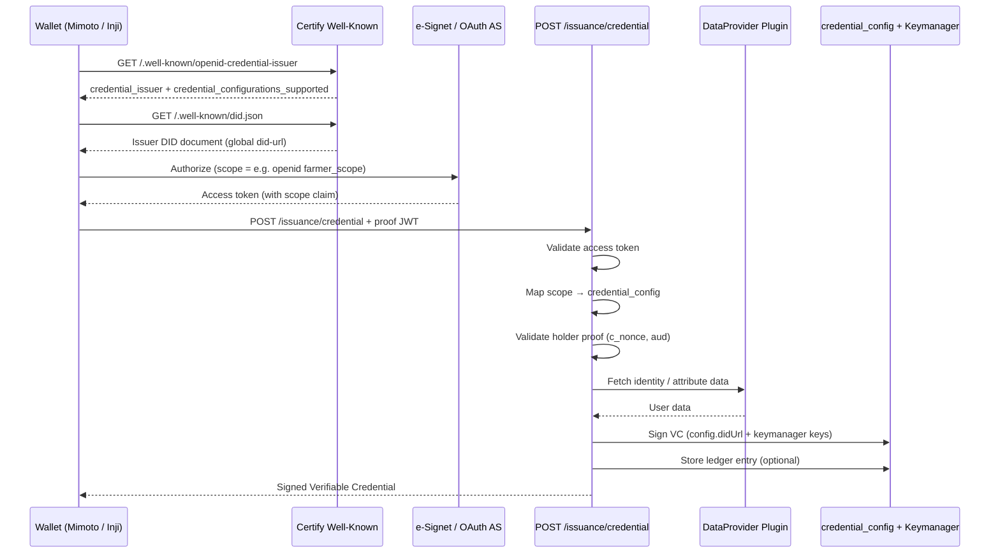

# Issuer Flow — End-to-End OID4VCI

This document walks through the **current** credential issuance flow in Inji Certify, showing where issuer identity appears at each step.

---

## High-level sequence



---

## Step 1 — Discovery (Well-Known)

The wallet discovers what credentials Certify can issue.

**Request:**

```
GET /v1/certify/.well-known/openid-credential-issuer?version=latest
```

**Controller:** `WellKnownController.getCredentialIssuerMetadata()`

**Response highlights:**

```json
{
  "credential_issuer": "http://certify-nginx:80",
  "authorization_servers": ["https://esignet.example.com"],
  "credential_endpoint": "http://certify-nginx:80/v1/certify/issuance/credential",
  "display": [{ "name": "Agriculture Department", "locale": "en" }],
  "credential_configurations_supported": {
    "FarmerLandRegistry": {
      "format": "ldp_vc",
      "scope": "farmer_scope",
      "cryptographic_binding_methods_supported": ["did:jwk"],
      "proof_types_supported": { "jwt": { ... } }
    }
  }
}
```

**Issuer fields:**

| Field | Source |
|-------|--------|
| `credential_issuer` | `mosip.certify.domain.url` |
| `authorization_servers` | `mosip.certify.authorization.url` or `as-mapping` |
| `credential_endpoint` | Built from `domain.url` + servlet path |
| `display` | `mosip.certify.credential-config.issuer.display` |
| `credential_configurations_supported` | All active `credential_config` rows |

---

## Step 2 — DID Document

The wallet (or verifier) fetches the issuer's public keys for proof verification.

**Request:**

```
GET /v1/certify/.well-known/did.json
```

**Behavior:**

- Document `id` = global `mosip.certify.data-provider-plugin.did-url`
- Verification methods aggregated from **all** active credential configurations
- Per-config `didUrl` is used at **signing time**, not for this endpoint

---

## Step 3 — Authorization

The wallet redirects the user to e-Signet (or Certify in OAuth AS mode) to obtain an access token.

**Flow:**

1. Wallet sends OAuth authorization request with `scope` matching a credential configuration (e.g. `farmer_scope`).
2. User authenticates.
3. e-Signet returns an access token containing the `scope` claim.

**Certify validates the token:**

- `AccessTokenValidationFilter` checks the token issuer against `mosip.certify.authn.issuer-uri`
- Token must be active and contain a valid `scope`

---

## Step 4 — Credential Request

The wallet requests the credential with a holder proof.

**Request:**

```
POST /v1/certify/issuance/credential
Authorization: Bearer <access_token>

{
  "format": "ldp_vc",
  "credential_definition": {
    "@context": ["https://www.w3.org/2018/credentials/v1"],
    "type": ["VerifiableCredential", "FarmerLandRegistry"]
  },
  "proof": {
    "proof_type": "jwt",
    "jwt": "<holder_proof_jwt>"
  }
}
```

---

## Step 5 — Issuance Processing

**Service:** `CertifyIssuanceServiceImpl.getCredential()` (DataProvider mode) or `VCIssuanceServiceImpl` (plugin mode)

### 5.1 Request validation

- Credential request format and required fields are validated.

### 5.2 Scope → credential config mapping

```java
String scopeClaim = (String) parsedAccessToken.getClaims().getOrDefault("scope", "");
for (String scope : scopeClaim.split(" ")) {
    Optional<CredentialMetadata> result = getScopeCredentialMapping(
        scope, credentialRequest.getFormat(),
        credentialConfigurationService.fetchCredentialIssuerMetadata("latest"),
        credentialRequest
    );
    if (result.isPresent()) {
        credentialMetadata = result.get();
        break;
    }
}
```

The scope from the access token is matched against metadata. The first matching credential configuration is used.

### 5.3 Proof validation

- `JwtProofValidator` validates the holder proof JWT
- Checks `c_nonce`, `aud` (against `mosip.certify.identifier`), and signing algorithm

### 5.4 Data fetch

- DataProvider plugin fetches identity/attribute data for the authenticated user
- Data is merged into the VC template (Velocity)

### 5.5 Signing

| Format | Issuer used for signing |
|--------|-------------------------|
| JSON-LD (ldp_vc) | `credential_config.didUrl` via `vcFormatter.getDidUrl(templateName)` |
| SD-JWT (vc+sd-jwt) | `mosip.certify.identifier` in `iss` claim |
| mDoc (mso_mdoc) | `credential_config.didUrl` as `_issuer` |

```java
VCResult<?> result = cred.addProof(
    unsignedCredential, "",
    vcFormatter.getProofAlgorithm(templateName),
    vcFormatter.getAppID(templateName),
    vcFormatter.getRefID(templateName),
    vcFormatter.getDidUrl(templateName),   // per-config DID
    vcFormatter.getSignatureCryptoSuite(templateName)
);
```

### 5.6 Ledger (optional)

If `mosip.certify.issuer.ledger-enabled=true`:

```java
credentialLedgerService.storeLedgerEntry(
    credentialId,
    didUrl,          // global plugin did-url, NOT per-config didUrl
    credentialType,
    credentialStatusDetail,
    indexedAttributes,
    issuanceDate
);
```

---

## Step 6 — Response

The wallet receives the signed credential:

```json
{
  "credential": "<signed VC>",
  "c_nonce": "<new_nonce>",
  "c_nonce_expires_in": 300
}
```

---

## Alternate flows

### Pre-authorized code flow

Used when credentials are offered without interactive user login (e.g. QR code).

1. Admin calls `POST /pre-authorized-data` → creates credential offer
2. Offer contains `credential_issuer` = `mosip.certify.identifier`
3. Wallet redeems pre-auth code → gets access token → calls `/issuance/credential`

See [Pre-Authorized Code](../Pre-Authorized-Code.md).

### Presentation During Issuance (PDI)

Holder presents an existing VC during issuance. Same issuance endpoint; additional VP validation before data fetch.

See [Presentation During Issuance](../Presentation-During-Issuance.md).

### Certify as Authorization Server

When Certify acts as its own OAuth AS:

- `GET /.well-known/oauth-authorization-server` returns metadata with `issuer` = `mosip.certify.oauth.issuer`
- IAR (Interactive Authorization Request) flow issues tokens with scope from `authorization_details.credential_configuration_id`

---

## Issuer identity summary across the flow

| Step | Issuer value used |
|------|-------------------|
| Metadata `credential_issuer` | `mosip.certify.domain.url` |
| DID document `id` | `mosip.certify.data-provider-plugin.did-url` |
| Proof `aud` validation | `mosip.certify.identifier` |
| VC signing (JSON-LD) | `credential_config.didUrl` |
| VC signing (SD-JWT `iss`) | `mosip.certify.identifier` |
| Ledger `issuer_id` | Global `did-url` |
| Pre-auth offer `credential_issuer` | `mosip.certify.identifier` |

**Inconsistency to note:** JSON-LD signing can use per-config `didUrl`, but SD-JWT `iss`, proof `aud`, ledger, and pre-auth offers all use global properties. This is one of the gaps addressed in the multi-issuer plan.

---

## Next

- [Gap Analysis](./Gap-Analysis.md) — What prevents true multi-issuer today
- [Implementation Plan](./Implementation-Plan.md) — How the flow will change
