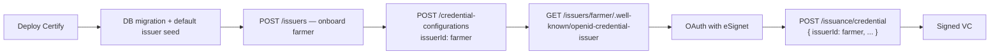

# Multi-Issuer Support — POC Proposal

**Audience:** Inji team, tech leads, architects  
**Status:** Proof of Concept (branch implementation reviewed against [Multi-issuer-impl-plan.md](./Multi-issuer-impl-plan.md))  
**Goal:** Propose runtime multi-issuer support in a single Certify deployment, with a clear picture of what is done, what aligns with the design, and what remains before production.

---

## 1. Executive summary

Today, one Certify instance behaves as **one credential issuer**. Issuer identity, signing keys, and DID come from global Spring properties set at deploy time. Running Farmer and mDL credentials from the same Certify instance requires workarounds (separate deployments or wallet-side hacks).

This POC adds an **issuer registry** and threads `issuerId` through discovery, credential configuration, and OID4VCI issuance — **without changing issuance URL paths**. Existing single-issuer deployments keep working via a seeded `default` issuer.

**What you can demo today**

1. Onboard a second issuer at runtime (`POST /issuers`) with Keymanager key generation.
2. Register credential templates scoped to that issuer (`POST /credential-configurations` with `issuerId`).
3. Discover per-issuer metadata via spec-compliant URL (`GET /issuers/farmer/.well-known/openid-credential-issuer`).
4. Issue VCs via the **same** OID4VCI endpoint with `issuerId` in the request body.
5. (Optional) Issue template-based VCs via W3C VC API (`POST /vc-api/credentials/issue`) when enabled.

**What is not production-ready yet:** startup key slimming, per-issuer pre-auth, per-issuer JWKS, formal DB upgrade script in release pipeline, dedicated issuer tests, OpenAPI updates, and Mimoto injistack reference config.

---

## 2. Problem statement

| Today | After multi-issuer |
|-------|-------------------|
| One `credential_issuer` URL per Certify deployment | Many logical issuers, one Certify instance |
| Issuer keys provisioned at startup (`AppConfig.initKeys`) | Per-issuer keys at onboarding time |
| Global `mosip.certify.identifier` for proof `aud`, SD-JWT `iss` | Per-issuer `identifier` from registry |
| All active `credential_config` rows in one metadata document | Metadata filtered by `issuerId` |
| Second department = second Certify or Mimoto workaround | `POST /issuers` + `issuerId` on existing APIs |

See [Gap Analysis](./Gap-Analysis.md) and [Issuer Flow](./Issuer-Flow.md) for the current single-issuer behaviour.

---

## 3. Design principles

| Principle | Rationale |
|-----------|-----------|
| **Issuance URLs unchanged** | `POST /issuance/credential` (and vd11/vd12) — no breaking change for wallets, Mimoto, api-test |
| **`issuerId` in credential request body** | Optional on issuance; defaults to `default` for backward compatibility |
| **OID4VCI well-known is spec-strict** | `/.well-known/openid-credential-issuer` returns **only** OpenID4VCI-defined fields — no custom attributes (e.g. no `issuerId` in the JSON response, no Certify-specific query params on this endpoint) |
| **Per-issuer discovery via `credential_issuer` URL** | Each issuer gets a unique `credential_issuer` base URL; wallet fetches `{credential_issuer}/.well-known/openid-credential-issuer` per the spec ([Gap Analysis §2](./Gap-Analysis.md)) |
| **Reuse issuance pipeline** | Velocity, `CredentialFactory`, proof generators, ledger — same code path after issuer resolution |
| **Issuer onboarding owns keys** | New issuers get namespaced Keymanager app IDs (`CERTIFY_ISSUER_{ID}_{ALGO}`) |

### 3.1 OID4VCI discovery — what is and is not allowed

Per [OpenID4VCI](https://openid.net/specs/openid-4-verifiable-credential-issuance-1_0.html), the Credential Issuer Metadata endpoint:

- Is resolved from the issuer's **`credential_issuer` identifier URL** — not from a shared URL with a custom selector.
- Must return a **spec-defined JSON document** (`credential_issuer`, `authorization_servers`, `credential_endpoint`, `credential_configurations_supported`, `display`, etc.).
- Must **not** include Certify-specific extensions in that response.

**Correct multi-issuer discovery (target design):**

```
credential_issuer (farmer) = https://certify.example.com/v1/certify/issuers/farmer

GET https://certify.example.com/v1/certify/issuers/farmer/.well-known/openid-credential-issuer
→ { "credential_issuer": "https://certify.example.com/v1/certify/issuers/farmer", ... }
```

**Not spec-compliant (POC deviation — must be fixed):**

```
GET /.well-known/openid-credential-issuer?issuerId=farmer   ← custom query param on OID4VCI endpoint
```

`issuerId` remains valid on **admin APIs** (`POST /credential-configurations`) and **issuance** (`POST /issuance/credential` body). It must not be used to select the issuer on the OID4VCI metadata endpoint itself.

**Backward compatibility:** `GET /.well-known/openid-credential-issuer` (no path prefix) continues to serve the `default` issuer for existing single-issuer deployments.

---

## 4. POC architecture

```mermaid
flowchart TB
    subgraph NEW["New (POC)"]
        IOC[IssuerController<br/>POST/GET/PUT/DELETE /issuers]
        IOS[IssuerOnboardingService]
        IRS[IssuerResolver]
        IC[IssuerContext]
        IT[(issuer table)]
        VCA[VCApiController<br/>optional POC add-on]
    end

    subgraph CHANGED["Changed"]
        WK[WellKnownController<br/>/issuers/{id}/.well-known/...]
        CCS[CredentialConfigurationServiceImpl]
        CIS[CertifyIssuanceServiceImpl]
        JPV[JwtProofValidator]
        SLC[StatusListCredentialService]
        DID[DIDDocumentUtil]
    end

    subgraph REUSED["Reused unchanged"]
        VCI[VCIssuanceController<br/>same /issuance paths]
        KM[KeymanagerService]
        VF[VCFormatter / Velocity]
        CF[CredentialFactory]
        LD[CredentialLedgerService]
    end

    IOC --> IOS --> KM
    IOS --> IT
    WK --> CCS --> IT
    VCI --> CIS
    CIS --> IRS --> IC
    CIS --> VF --> CF --> KM
    CIS --> LD
    VCA --> CCS
```

---

## 5. End-to-end operator flow (POC)



| Step | API | Notes |
|------|-----|-------|
| 1 | Deploy Certify | Platform keys still init at startup (see gaps) |
| 2 | Run migration | `issuer` table + `credential_config.issuer_id`; `default` issuer seeded |
| 3 | `POST /issuers` | Creates issuer record + Keymanager signing keys |
| 4 | `POST /credential-configurations` | `issuerId` required; keys must match onboarded issuer |
| 5 | `GET /issuers/{id}/.well-known/openid-credential-issuer` | Per-issuer OID4VCI metadata (spec-compliant; no custom fields) |
| 6 | `GET /issuers/{id}/did.json` | Per-issuer DID document (did:web resolution target) |
| 7 | Wallet E2E | Mimoto `wellknown_endpoint` = per-issuer metadata URL; credential request includes matching `issuerId` |

---

## 6. Implementation status vs plan

Legend: ✅ Done · 🟡 Partial · ❌ Not done · ➕ POC addition (not in original plan)

### 6.1 Data model

| Item | Plan | POC status |
|------|------|------------|
| `issuer` table DDL | Section 13.1 | ✅ `db_scripts/inji_certify/ddl/certify-issuer.sql` |
| `credential_config.issuer_id` FK | Section 13.2 | ✅ In `certify-credential_config.sql` + docker migration |
| `status_list_credential.issuer_id` | Implied | ✅ Column + repository queries |
| Formal `db_upgrade_script` release script | Section 13.3 | 🟡 Docker-only `certify_multi_issuer_upgrade.sql`; no `0.14.0_to_0.15.0` in `db_upgrade_script/` |
| `default` issuer seed on migration | Section 13.3 | ✅ `IssuerBootstrapConfig` + docker SQL |

### 6.2 Issuer onboarding API

| Item | Plan | POC status |
|------|------|------------|
| `POST /issuers` | Section 5.1 | ✅ `IssuerController` + `IssuerOnboardingService` |
| `GET /issuers`, `GET /issuers/{id}` | Section 5.1 | ✅ |
| `PUT /issuers/{id}`, `DELETE /issuers/{id}` | Section 5.1 | ✅ Soft deactivate via `IssuerServiceImpl` |
| Keymanager key generation per algo | Section 15 | ✅ EdDSA, RS256, ES256, ES256K |
| Key namespace `CERTIFY_ISSUER_{ID}_{ALGO}` | Section 15 | ✅ `IssuerConstants.KEY_APP_ID_PREFIX` |
| `issuerId` validation pattern | Section 6.3 | ✅ `IssuerConstants.ISSUER_ID_PATTERN` |
| Duplicate issuer → 409 | Section 19 | ✅ `ISSUER_ALREADY_EXISTS` |
| Auto `did:web` derivation | Section 6.1 | ✅ `DidWebUtil.buildIssuerDidWebIdentifier` |
| Per-issuer `identifier` | Section 6.2 | 🟡 New issuers currently get global `mosip.certify.identifier` |
| Per-issuer `credential_issuer_url` | Section 6.2 | 🟡 All issuers share `domain.url + servletPath` today |

### 6.3 Discovery (well-known) — OID4VCI spec compliance

| Item | Target design | POC status |
|------|---------------|------------|
| Per-issuer `credential_issuer` URL in metadata response | `{domain}{servletPath}/issuers/{issuerId}` | ❌ All issuers share `domain.url + servletPath` today |
| `GET /issuers/{issuerId}/.well-known/openid-credential-issuer` | Spec-compliant per-issuer discovery | ❌ Not implemented; only global `/.well-known/openid-credential-issuer` exists |
| No custom query params on OID4VCI metadata endpoint | `issuerId` must not appear as `?issuerId=` on this URL | ❌ **POC deviation:** `WellKnownController` accepts `?issuerId=` |
| Metadata response — spec fields only | No custom JSON attributes | ✅ Response DTO uses OID4VCI field names only |
| `GET /.well-known/openid-credential-issuer` (no prefix) | Serves `default` issuer (backward compat) | ✅ |
| `GET /issuers/{issuerId}/did.json` | did:web resolution target | ✅ |
| `GET /issuers/{issuerId}/.well-known/jwks.json` | Per-issuer JWKS | ❌ Not implemented |
| Metadata filtered by issuer internally | `credential_configurations_supported` scoped to issuer | ✅ `CredentialConfigurationServiceImpl` filters by `issuer_id` |

### 6.4 Credential configuration

| Item | Plan | POC status |
|------|------|------------|
| `issuerId` on create/update DTO | Section 4.2 | ✅ |
| `GET /credential-configurations?issuerId=` | Not explicit in plan | ➕ List endpoint added |
| Validate issuer ACTIVE | Section 4.2 | ✅ |
| Cross-issuer key mismatch guard | Section 19 | ✅ `CROSS_ISSUER_CONFIG_MISMATCH` |
| Scope uniqueness per issuer | Implied | ✅ Repository `findByIssuerIdAnd...` queries |
| Cache key includes issuer | Section 11 | ✅ `CredentialCacheKeyGenerator` |

### 6.5 OID4VCI issuance (unchanged URLs)

| Item | Plan | POC status |
|------|------|------------|
| `CredentialRequest.issuerId` | Section 4.4 | ✅ |
| `VCIssuanceController` paths unchanged | Section 3.1 | ✅ |
| `CertifyIssuanceServiceImpl` resolves issuer | Section 16 | ✅ |
| `VCIssuanceServiceImpl` (plugin mode) | Section 11 | ✅ |
| Scope → config filtered by issuer | Section 16 | ✅ |
| Proof `aud` = `issuer.identifier` | Section 16 | ✅ `JwtProofValidator` + `IssuerContext` |
| SD-JWT `iss` from issuer | Section 16 | ✅ Template params use `issuer.getIdentifier()` |
| Ledger `issuer_id` from issuer | Section 16 | ✅ `issuer.getDidUrl()` |
| Status list per issuer | Section 11 | ✅ `StatusListCredentialService` |
| DID document filtered by issuer configs | Section 11 | ✅ `DIDDocumentUtil.generateDIDDocument(didUrl, issuerId)` |

### 6.6 Platform / compatibility

| Item | Plan | POC status |
|------|------|------------|
| `IssuerResolver` + `IssuerContext` | Section 9 | ✅ |
| `IssuerBootstrapConfig` seeds `default` | Section 14 | ✅ Links to existing `CERTIFY_VC_SIGN_ED25519` keys |
| Slim `AppConfig.initKeys` (platform keys only) | Section 14 | ❌ Global VC keys still generated at startup |
| Pre-auth per issuer | Section 11 | 🟡 `PreAuthorizedCodeService` still uses global `issuerIdentifier` |
| Plugin SPI passes `issuerId` | Section 21 | ❌ Not done (optional v1 in plan) |

### 6.7 Tests, docs, and integration

| Item | Plan | POC status |
|------|------|------------|
| `IssuerControllerTest` | Section 10 | ❌ |
| `IssuerOnboardingServiceTest` | Section 10 | ❌ |
| `IssuerResolverTest` | Section 10 | ❌ |
| Cross-issuer isolation test | Section 10 | ❌ |
| `WellKnownControllerTest` issuer filter | Section 10 | 🟡 Existing test file; issuer-specific cases TBD |
| OpenAPI: `/issuers` APIs | Section 20 | ❌ |
| OpenAPI: `issuerId` on credential request | Section 20 | ❌ |
| Mimoto injistack per-issuer well-known path | Section 18 | ❌ `mimoto-issuers-config.json` still uses shared global URL |
| Docker compose POC migration | Section 18 | ✅ `certify_multi_issuer_upgrade.sql` |

### 6.8 POC addition — W3C VC API (not in original plan)

| Item | Description | Status |
|------|-------------|--------|
| `POST /vc-api/credentials/issue` | Template-based issuance with `credentialConfigurationId`; API key auth | ➕ ✅ Behind `mosip.certify.vc-api.enabled` |
| `VCApiSecurityConfig` + `VCApiKeyAuthFilter` | Separate security filter chain | ➕ ✅ |
| Use case | Quick demo / server-to-server issuance without OID4VCI token flow | POC only — discuss with team if this ships in v1 |

---

## 7. API surface (POC)

### 7.1 New — Issuer management

| Method | Path | Description |
|--------|------|-------------|
| POST | `/v1/certify/issuers` | Onboard issuer (keys + DB record) |
| GET | `/v1/certify/issuers` | List issuers |
| GET | `/v1/certify/issuers/{issuerId}` | Get issuer |
| PUT | `/v1/certify/issuers/{issuerId}` | Update display / status |
| DELETE | `/v1/certify/issuers/{issuerId}` | Deactivate (soft) |

### 7.2 Changed — Discovery and config

| Method | Path | Change |
|--------|------|--------|
| GET | `/issuers/{issuerId}/.well-known/openid-credential-issuer` | **Target:** per-issuer OID4VCI metadata (spec-compliant) |
| GET | `/.well-known/openid-credential-issuer` | Unchanged path; serves `default` issuer (backward compat) |
| GET | `/issuers/{issuerId}/did.json` | Per-issuer DID (did:web resolution) |
| GET | `/credential-configurations?issuerId={id}` | Admin API — list configs for issuer |
| POST | `/credential-configurations` | Admin API — requires `issuerId` |

> **POC gap:** Code currently exposes `?issuerId=` on `/.well-known/openid-credential-issuer`. This is a temporary deviation and must be replaced with path-based per-issuer URLs before production.

### 7.3 Unchanged — OID4VCI issuance

| Method | Path | Change |
|--------|------|--------|
| POST | `/issuance/credential` | Body gains optional `issuerId` |
| POST | `/issuance/vd11/credential` | Same |
| POST | `/issuance/vd12/credential` | Same |

### 7.4 Optional — VC API (POC add-on)

| Method | Path | Auth |
|--------|------|------|
| POST | `/vc-api/credentials/issue` | `X-API-Key` header; `mosip.certify.vc-api.enabled=true` |

---

## 8. Sample POC walkthrough

### 8.1 Onboard a new issuer

```http
POST /v1/certify/issuers
Content-Type: application/json

{
  "issuerId": "farmer",
  "display": [{ "name": "Agriculture Department", "locale": "en" }],
  "signingConfig": {
    "signatureCryptoSuite": "Ed25519Signature2020",
    "signatureAlgo": "EdDSA"
  }
}
```

Response includes `keyManagerAppId`, `keyManagerRefId`, `didUrl`, and per-issuer `credentialIssuerUrl` (target: `.../issuers/farmer`).

### 8.2 Register credential template

```http
POST /v1/certify/credential-configurations
Content-Type: application/json

{
  "issuerId": "farmer",
  "keyManagerAppId": "<from onboarding response>",
  "keyManagerRefId": "<from onboarding response>",
  "vcTemplate": "...",
  ...
}
```

### 8.3 Wallet discovery (spec-compliant)

```http
GET /v1/certify/issuers/farmer/.well-known/openid-credential-issuer
```

Response (OID4VCI fields only — illustrative):

```json
{
  "credential_issuer": "https://certify.example.com/v1/certify/issuers/farmer",
  "authorization_servers": ["https://esignet.example.com"],
  "credential_endpoint": "https://certify.example.com/v1/certify/issuance/credential",
  "credential_configurations_supported": { ... }
}
```

### 8.4 Issue credential (same endpoint as today)

```http
POST /v1/certify/issuance/credential
Authorization: Bearer <access_token>

{
  "format": "ldp_vc",
  "issuerId": "farmer",
  "credential_definition": { ... },
  "proof": { "proof_type": "jwt", "jwt": "..." }
}
```

---

## 9. Wallet / Mimoto integration impact

For multi-issuer in one Certify instance, Mimoto (or any wallet) must:

1. **Discovery:** Each issuer entry gets a **distinct `wellknown_endpoint`** pointing to that issuer's OID4VCI metadata URL — no shared URL, no custom query params:

   ```json
   "wellknown_endpoint": "http://certify-nginx/v1/certify/issuers/farmer/.well-known/openid-credential-issuer"
   ```

   The wallet reads `credential_issuer` from the response; that value must uniquely identify the farmer issuer.

2. **Issuance:** Include matching `issuerId` in the OID4VCI credential request body (Certify admin/issuance concern — not part of the well-known response).

3. **Legacy single issuer:** Keep `wellknown_endpoint` at `/.well-known/openid-credential-issuer` (default issuer); omit `issuerId` in credential requests.

**POC gaps:**

- `mimoto-issuers-config.json` still points both issuers to the same global well-known URL.
- Certify does not yet expose `/issuers/{issuerId}/.well-known/openid-credential-issuer`.
- Onboarding sets the same `credential_issuer_url` for all issuers instead of a per-issuer path.

---

## 10. Backward compatibility (verified design)

| Scenario | Expected behaviour | POC |
|----------|-------------------|-----|
| Existing deployment, no new issuers | `default` issuer from bootstrap/migration | ✅ |
| Well-known without `issuerId` | `default` issuer metadata | ✅ |
| Credential request without `issuerId` | Issues under `default` | ✅ |
| Existing credential configs | `issuer_id = 'default'` after migration | ✅ |
| Existing global signing keys | Linked to `default` issuer in bootstrap | ✅ |

---

## 11. Known gaps and risks (for production discussion)

| # | Gap | Risk | Recommendation |
|---|-----|------|----------------|
| 1 | **`?issuerId=` on OID4VCI well-known endpoint** | Non-spec-compliant; wallets expect standard `{credential_issuer}/.well-known/...` | Add `/issuers/{issuerId}/.well-known/openid-credential-issuer`; remove `issuerId` query param from metadata endpoint |
| 2 | Shared `credential_issuer_url` for all issuers | Metadata `credential_issuer` does not uniquely identify each issuer per OID4VCI | Set `credential_issuer_url = {domain}{servletPath}/issuers/{issuerId}` at onboarding |
| 3 | `AppConfig` still creates global `CERTIFY_VC_SIGN_*` keys at startup | Redundant keys; plan was per-issuer only at onboarding | Phase 2: slim startup to platform keys; keep global keys only for `default` migration |
| 4 | New issuers share global `identifier` | SD-JWT `iss` and proof `aud` may not distinguish issuers | Derive per-issuer `identifier` aligned with `credential_issuer_url` |
| 5 | Pre-auth not issuer-aware | Pre-auth offers always use global `credential_issuer` | Add `issuerId` to pre-auth API and offers |
| 6 | JWKS not per-issuer | Verifiers may get wrong keys for multi-issuer | `GET /issuers/{issuerId}/.well-known/jwks.json` |
| 7 | No formal release upgrade script | Production upgrades need manual/docker SQL | Add `db_upgrade_script/inji_certify/sql/*_upgrade.sql` |
| 8 | Missing issuer-focused tests | Regression risk on isolation | Add onboarding, resolver, cross-issuer negative tests |
| 9 | OpenAPI not updated | External integrators lack contract | Update `docs/inji-certify-openapi.yaml` |
| 10 | Auth on `POST /issuers` | Same as credential-config today (confirm policy) | Align with admin API security model |
| 11 | VC API scope | Extra surface area not in v1 plan | Team decision: ship, defer, or keep behind feature flag |

---

## 12. Recommended phasing for production

### Phase 1 — Merge POC core (this branch)

- Issuer registry + onboarding API
- `issuerId` on credential config, well-known, and issuance
- `default` issuer backward compatibility
- DB DDL + docker migration

### Phase 2 — Hardening

- Path-based OID4VCI well-known (`/issuers/{id}/.well-known/openid-credential-issuer`); remove `?issuerId=` from metadata endpoint
- Per-issuer `credential_issuer_url` at onboarding (`.../issuers/{issuerId}`)
- Issuer unit/integration tests + cross-issuer isolation
- Per-issuer `identifier` and pre-auth support
- OpenAPI + Mimoto injistack reference update
- Slim `AppConfig.initKeys`

### Phase 3 — Ecosystem

- Mimoto / Inji Wallet changes for `issuerId` in credential requests
- Plugin SPI `issuerId` (if DataProvider needs per-issuer behaviour)
- Per-issuer JWKS
- Admin UI for issuer onboarding (out of scope for Certify-only PR)

---

## 13. Open questions for team review

| # | Question | POC recommendation |
|---|----------|-------------------|
| 1 | Is `issuerId` required in credential requests for new issuers? | Optional with `default` fallback — wallets must send it for non-default issuers |
| 2 | How to select issuer on OID4VCI well-known? | **Path-based:** `/issuers/{issuerId}/.well-known/openid-credential-issuer` — no custom query params on this endpoint |
| 3 | Should VC API ship in v1? | Keep behind `mosip.certify.vc-api.enabled`; decide separately from OID4VCI multi-issuer |
| 4 | Per-issuer `credential_issuer` URL shape? | `{domain}{servletPath}/issuers/{issuerId}` — matches well-known path and uniquely identifies issuer per spec |
| 5 | Who can call `POST /issuers`? | Same auth as credential-config admin APIs (confirm) |
| 6 | Keymanager app ID length limit (36 chars) | Long `issuerId` values are rejected — document max slug length |

---

## 14. Proposal ask

We recommend the Inji team review this POC for **concept approval** and **Phase 1 merge**, with Phase 2 items tracked as follow-up tasks.

**Approval sought on:**

1. **OID4VCI well-known stays spec-strict** — per-issuer path `/issuers/{id}/.well-known/openid-credential-issuer`; no custom attributes or `?issuerId=` on the metadata endpoint.
2. **`issuerId` in issuance request body** — not in issuance URL paths (backward compatible).
3. **Runtime issuer onboarding** — keys at `POST /issuers`, not at Certify boot (with `default` migration exception).
4. **Mimoto change** — distinct `wellknown_endpoint` per issuer entry (path-based) + `issuerId` in credential request body.
4. **VC API** — include, defer, or feature-flag only.

---

## 15. Related documents

| Document | Purpose |
|----------|---------|
| [Multi-issuer-impl-plan.md](./Multi-issuer-impl-plan.md) | Full technical design (pre-implementation) |
| [Gap Analysis](./Gap-Analysis.md) | Why single-issuer today is insufficient |
| [Issuer Flow](./Issuer-Flow.md) | Current OID4VCI flow (pre-change) |
| [Current Architecture](./Current-Architecture.md) | Where issuer identity lives in code today |
