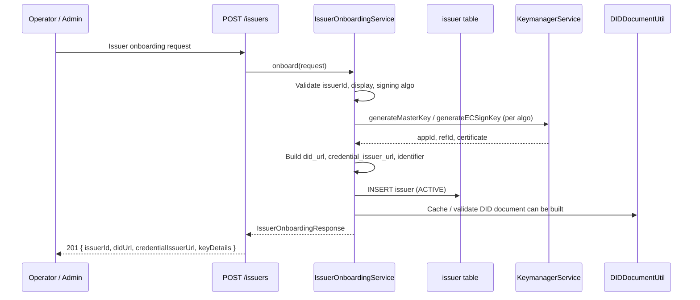
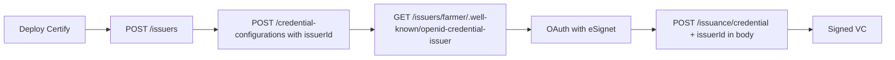
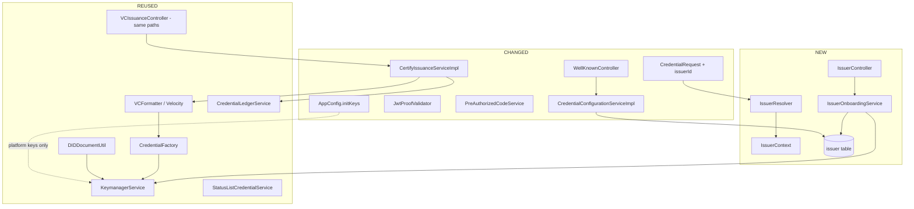
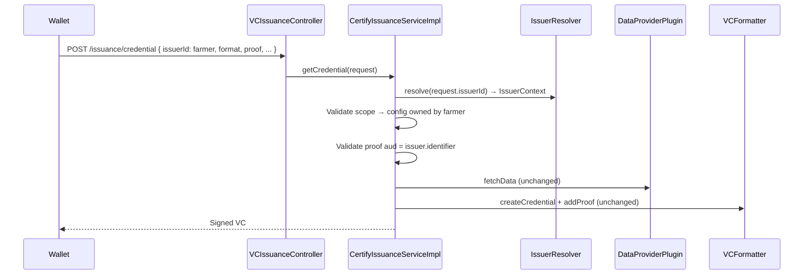

# Multi-Issuer Support — Implementation Design

Design document for adding **multi-issuer support** to Inji Certify .

---

## 1. Summary

| Item | Description |
|------|-------------|
| **Problem** | Issuer identity, signing keys, and DID are tied to Certify **startup initialization** and **global properties**. One instance = one issuer. |
| **Proposal** | Introduce an **Issuer Onboarding API** that creates the issuer, provisions keys via Keymanager, and registers DID — at runtime, not at Certify boot. |
| **After onboarding** | Per issuer: onboard credential templates (`credential_config`) → issue VCs via existing OID4VCI flow. |
| **Delivery** | New issuer layer + refactors to existing services, with backward compatibility for current deployments. |
| **Issuer in requests** | **Issuance:** `issuerId` in `CredentialRequest` body. **Discovery:** per-issuer `credential_issuer` URL + path-based well-known (OID4VCI spec — no custom query params on metadata endpoint). |

---

## 2. Background

### 2.1 What happens today at Certify initialization

On startup, `AppConfig` (`ApplicationRunner`) calls `initKeys()` which provisions **global** Keymanager keys for the whole deployment:

```
AppConfig.run()
  └── initKeys()
        ├── ROOT_KEY, CERTIFY_SERVICE master key
        ├── CERTIFY_PARTNER master key
        └── (DataProvider mode) VC signing keys:
              CERTIFY_VC_SIGN_RSA, CERTIFY_VC_SIGN_ED25519,
              CERTIFY_VC_SIGN_EC_K1, CERTIFY_VC_SIGN_EC_R1
```

Issuer identity is **not** stored in the database. It comes from properties:

| Property | Used for |
|----------|----------|
| `mosip.certify.domain.url` | OID4VCI `credential_issuer` |
| `mosip.certify.identifier` | SD-JWT `iss`, proof `aud`, pre-auth offers |
| `mosip.certify.data-provider-plugin.did-url` | DID document, ledger `issuer_id` |

DID document is built at request time by `DIDDocumentUtil.generateDIDDocument(didUrl)` — aggregating verification methods from **all** active `credential_config` rows and their Keymanager certificates.

### 2.2 Current onboarding sequence (operator today)

```
1. Deploy Certify  →  initKeys() runs (global signing keys)
2. Set properties  →  domain.url, identifier, did-url
3. POST /credential-configurations  →  template + signing key refs
4. Host /.well-known/did.json
5. Wallet discovers + issues VCs
```

**Gap:** Steps 1–2 assume **one issuer per deployment**. Adding a second department (e.g. Farmer + mDL) requires either a second Certify instance or wallet-side workarounds (Mimoto config pointing to the same well-known URL).

### 2.3 What we want instead

```
1. Deploy Certify  →  only platform keys (ROOT, SERVICE master) at startup
2. POST /issuers    →  Issuer Onboarding API
       ├── Create issuer record in DB
       ├── Call Keymanager → generate issuer signing keys
       └── Register did_url / credential_issuer_url
3. POST /credential-configurations  →  with issuerId (template per issuer)
4. GET /issuers/farmer/.well-known/openid-credential-issuer
5. POST /issuance/credential  →  same URL; issuerId in request body → issue VC
```

---

## 3. Proposed approach

### 3.1 Design principle — issuance API stays the same

| Aspect | Decision |
|--------|----------|
| **Issuance URLs** | No change — `POST /issuance/credential` (and vd11/vd12) |
| **How issuer is passed** | `issuerId` field in `CredentialRequest` JSON body |
| **If `issuerId` omitted** | Use `default` issuer (existing deployments unaffected) |
| **What changes internally** | Resolve issuer → filter credential configs → **same signing/template/ledger flow** |
| **Well-known URLs** | Per-issuer path: `/issuers/{issuerId}/.well-known/openid-credential-issuer` — **OID4VCI spec-strict** (no custom query params or response fields) |

This avoids breaking wallets, Postman collections, api-test YAML, and Mimoto integrations that already call `/issuance/credential`.

---

Multi-issuer support is layered on top of the **existing issuance engine** with minimal duplication:

```
POST /issuers                              → IssuerOnboardingService (NEW)
                                               ├── IssuerRepository (NEW)
                                               └── KeymanagerService (EXISTING)

POST /credential-configurations            → CredentialConfigurationService (CHANGED: issuerId)

GET  /issuers/{issuerId}/.well-known/openid-credential-issuer  → WellKnownController (CHANGED: per-issuer, spec-compliant)
GET  /issuers/{issuerId}/.well-known/did.json                  → WellKnownController (CHANGED: per-issuer DID)
GET  /.well-known/openid-credential-issuer                     → default issuer only (backward compat)

POST /issuance/credential                  → VCIssuanceController (UNCHANGED URL)
       Body: { ..., "issuerId": "farmer" }  → CertifyIssuanceServiceImpl (CHANGED: read issuerId, filter, same flow)
                                                     ├── VCFormatter / Velocity (REUSED)
                                                     ├── CredentialFactory (REUSED)
                                                     ├── ProofGeneratorFactory (REUSED)
                                                     └── CredentialLedgerService (REUSED)
```

**Key design choices:**

1. **Issuer onboarding** owns key creation and DID registration (not Certify startup).
2. **Issuance endpoints are not changed** — no new paths under `/issuers/{id}/issuance/...`.
3. **`issuerId` in the credential request** — Certify loads issuer context, filters credential configs, then runs the **same issuance pipeline** as today.

---

## 4. New flow vs changed existing flow

### 4.1 NEW — Issuer onboarding flow



**What the onboarding API does (new responsibility):**

| Step | Action |
|------|--------|
| 1 | Validate `issuerId` (unique slug), display, signing algorithm |
| 2 | Call `KeymanagerService` to generate issuer-specific signing keys |
| 3 | Derive / assign `did_url` (e.g. `did:web:{host}/issuers/{issuerId}`) |
| 4 | Set `credential_issuer_url` (e.g. `{domain}/v1/certify/issuers/{issuerId}`) |
| 5 | Persist issuer in `issuer` table |
| 6 | Return key references (`keyManagerAppId`, `keyManagerRefId`) for credential config onboarding |

**What moves OUT of startup (`AppConfig.initKeys`):**

| Today at startup | After change |
|------------------|--------------|
| Global VC signing keys (RSA, Ed25519, EC K1, R1) for all issuers | Per-issuer keys created at **issuer onboarding** |
| Implicit single issuer from properties | Explicit issuer record in DB |
| `did-url` from properties only | `did_url` per issuer in DB |

**What stays at startup:**

| Key | Reason |
|-----|--------|
| ROOT_KEY | Platform |
| CERTIFY_SERVICE master key | Platform |
| CERTIFY_PARTNER master key | Platform |
| Cache symmetric key | Platform |

---

### 4.2 CHANGED — Credential template onboarding (per issuer)

Existing API: `POST /credential-configurations`

**Change:** Require `issuerId` in request. Validate issuer exists and is `ACTIVE`.

```
Before:  POST /credential-configurations  { vcTemplate, didUrl, keyManagerAppId, ... }
After:   POST /credential-configurations  { issuerId, vcTemplate, didUrl, keyManagerAppId, ... }
```

| Field | Source after change |
|-------|---------------------|
| `issuerId` | Required — must reference onboarded issuer |
| `didUrl` | Default to issuer's `did_url`; can be sub-DID per VC type |
| `keyManagerAppId` / `keyManagerRefId` | From issuer onboarding response, or issuer-specific namespace |
| `vcTemplate` | Unchanged — Velocity template in DB |

Credential configs are **scoped to one issuer**. Metadata and DID document only include configs for that issuer.

---

### 4.3 CHANGED — Discovery (well-known) — OID4VCI spec-strict

Per [OpenID4VCI](https://openid.net/specs/openid-4-verifiable-credential-issuance-1_0.html), Credential Issuer Metadata is fetched from:

```
{credential_issuer}/.well-known/openid-credential-issuer
```

Each onboarded issuer gets a **unique `credential_issuer` URL**. The metadata response contains **only spec-defined fields** — no Certify-specific attributes and no custom query parameters (such as `?issuerId=`) on this endpoint.

```
Before:  GET /.well-known/openid-credential-issuer           → all configs, one credential_issuer

After:   GET /issuers/farmer/.well-known/openid-credential-issuer
         → configs for farmer only
         → "credential_issuer": "https://certify.example.com/v1/certify/issuers/farmer"

         GET /.well-known/openid-credential-issuer           → default issuer (backward compat)
         GET /issuers/farmer/.well-known/did.json            → DID doc for farmer (did:web resolution)
```

| Response field | Source after change |
|----------------|---------------------|
| `credential_issuer` | `issuer.credential_issuer_url` = `{domain}{servletPath}/issuers/{issuerId}` |
| `authorization_servers` | `issuer.authorization_servers` (fallback: global property for `default`) |
| `display` | `issuer.display` |
| `credential_configurations_supported` | Only `credential_config` rows where `issuer_id = {issuerId}` |

**Wallet / Mimoto:** each issuer entry uses a distinct well-known URL, e.g.  
`http://certify/v1/certify/issuers/farmer/.well-known/openid-credential-issuer`

**Not allowed on this endpoint:** `?issuerId=farmer` on the global `/.well-known/openid-credential-issuer` path — that is a Certify-specific extension and violates OID4VCI discovery expectations. See [Gap Analysis §2](./Gap-Analysis.md).

`issuerId` remains valid on **admin APIs** (`POST /credential-configurations`) and **issuance** (`issuerId` in `CredentialRequest` body).

---

### 4.4 CHANGED — VC issuance (OID4VCI) — same API, issuer in request

**No new issuance URLs.** `VCIssuanceController` and endpoint paths remain unchanged:

```
POST /v1/certify/issuance/credential
POST /v1/certify/issuance/vd11/credential
POST /v1/certify/issuance/vd12/credential
```

**Change:** Add `issuerId` to `CredentialRequest` body. If omitted → `default` issuer (backward compatible).

```json
POST /v1/certify/issuance/credential
Authorization: Bearer <access_token>

{
  "format": "ldp_vc",
  "issuerId": "farmer",
  "credential_definition": {
    "@context": ["https://www.w3.org/2018/credentials/v1"],
    "type": ["VerifiableCredential", "FarmerLandRegistry"]
  },
  "proof": {
    "proof_type": "jwt",
    "jwt": "<holder_proof_jwt>"
  }
}
```

| Step | Change |
|------|--------|
| Issuer resolution | Read `issuerId` from `CredentialRequest` → load issuer from DB → set `IssuerContext` |
| Scope → config mapping | Filter metadata/configs where `issuer_id = request.issuerId` (default if omitted) |
| Proof `aud` validation | Use `issuer.identifier` instead of global `@Value` |
| SD-JWT `iss` claim | Use `issuer.identifier` |
| JSON-LD signing `didUrl` | Per-config `didUrl` (unchanged); config must belong to issuer |
| Ledger `issuer_id` | Use `issuer.did_url` |
| Template render + sign + plugin fetch | **Same flow as today** — no new issuance service |

**Reused as-is:** `VCIssuanceController` mappings, Velocity templating, `CredentialFactory`, proof generators, status list, ledger write logic, DataProvider plugin fetch.

---

## 5. API surface

### 5.1 NEW — Issuer onboarding

| Method | Path | Description |
|--------|------|-------------|
| POST | `/v1/certify/issuers` | Onboard issuer (create + Keymanager keys + DID) |
| GET | `/v1/certify/issuers` | List issuers |
| GET | `/v1/certify/issuers/{issuerId}` | Get issuer details |
| PUT | `/v1/certify/issuers/{issuerId}` | Update display, status |
| DELETE | `/v1/certify/issuers/{issuerId}` | Deactivate issuer (soft delete) |

### 5.2 CHANGED — Discovery (per-issuer paths, OID4VCI spec-strict)

| Method | Path | Change |
|--------|------|--------|
| GET | `/v1/certify/issuers/{issuerId}/.well-known/openid-credential-issuer` | Per-issuer metadata — spec-compliant |
| GET | `/v1/certify/issuers/{issuerId}/.well-known/did.json` | Per-issuer DID document |
| GET | `/v1/certify/issuers/{issuerId}/.well-known/jwks.json` | Per-issuer JWKS (if applicable) |
| GET | `/v1/certify/.well-known/openid-credential-issuer` | `default` issuer only (backward compatible) |

When the global path is used (no `/issuers/{id}` prefix) → `default` issuer.

### 5.3 UNCHANGED — Issuance (issuer in request body)

| Method | Path | Change |
|--------|------|--------|
| POST | `/v1/certify/issuance/credential` | **URL unchanged** — add `issuerId` to request body |
| POST | `/v1/certify/issuance/vd11/credential` | **URL unchanged** — add `issuerId` to request body |
| POST | `/v1/certify/issuance/vd12/credential` | **URL unchanged** — add `issuerId` to request body |

`CredentialRequest` (certify-core) gains optional field `issuerId`. Wallet / Mimoto sends it on every credential request after discovery.

### 5.4 CHANGED — Credential configuration

| Method | Path | Change |
|--------|------|--------|
| POST | `/v1/certify/credential-configurations` | Add required `issuerId` |
| PUT | `/v1/certify/credential-configurations/{id}` | Validate `issuerId` |
| GET | `/v1/certify/credential-configurations/{id}` | Return `issuerId` |

---

## 6. Issuer onboarding request / response

### 6.1 Request

```json
POST /v1/certify/issuers
Content-Type: application/json

{
  "issuerId": "farmer",
  "display": [
    {
      "name": "Agriculture Department",
      "locale": "en",
      "logo": { "url": "https://example.com/logo.png", "alt_text": "Agri" }
    }
  ],
  "signingConfig": {
    "signatureCryptoSuite": "Ed25519Signature2020",
    "signatureAlgo": "EdDSA"
  },
  "authorizationServers": [
    "https://esignet.example.com"
  ],
  "didUrl": "did:web:certify.example.com:issuers:farmer"
}
```

| Field | Required | Notes |
|-------|----------|-------|
| `issuerId` | Yes | Unique slug; used in URL path |
| `display` | Yes | Metadata display (same shape as today) |
| `signingConfig` | Yes | Drives Keymanager key generation |
| `authorizationServers` | No | Defaults to global `mosip.certify.authorization.url` |
| `didUrl` | No | Auto-derived if omitted: `did:web:{host}/issuers/{issuerId}` |

### 6.2 Response

```json
{
  "issuerId": "farmer",
  "status": "ACTIVE",
  "credentialIssuerUrl": "https://certify.example.com/v1/certify/issuers/farmer",
  "identifier": "https://certify.example.com/v1/certify",
  "didUrl": "did:web:certify.example.com:issuers:farmer",
  "keyManagerAppId": "CERTIFY_ISSUER_FARMER_ED25519",
  "keyManagerRefId": "ED25519_SIGN",
  "wellKnownEndpoints": {
    "openidCredentialIssuer": "https://certify.example.com/v1/certify/issuers/farmer/.well-known/openid-credential-issuer",
    "didJson": "https://certify.example.com/v1/certify/issuers/farmer/.well-known/did.json"
  }
}
```

### 6.3 Validation rules

- `issuerId` must match `^[a-z0-9][a-z0-9-]{1,62}[a-z0-9]$`
- `signingConfig.signatureCryptoSuite` / `signatureAlgo` must be in supported maps (same validation as credential config today)
- Duplicate `issuerId` → 409 Conflict
- Keymanager failure → 500 with rollback (no partial issuer record)

---

## 7. End-to-end operator flow (after implementation)



| Step | API | Who |
|------|-----|-----|
| 1 | Deploy Certify (platform keys only at startup) | Ops |
| 2 | `POST /issuers` — onboard Farmer issuer | Admin |
| 3 | `POST /issuers` — onboard mDL issuer | Admin |
| 4 | `POST /credential-configurations` with `issuerId: farmer` | Admin |
| 5 | `POST /credential-configurations` with `issuerId: mock-mdl` | Admin |
| 6 | Update Mimoto `wellknown_endpoint` to per-issuer path per issuer | Ops |
| 7 | Wallet E2E: discover → auth → issue with `issuerId` in credential request | QA |

---

## 8. Flow diagrams

### 8.1 High-level architecture



### 8.2 VC issuance sequence (same endpoint, issuer in body)



---

## 9. Where the code lives (package layout)

### 9.1 certify-core (DTOs + SPI)

```
certify-core/src/main/java/io/mosip/certify/core/
├── dto/
│   ├── IssuerOnboardingRequest.java       NEW
│   ├── IssuerOnboardingResponse.java      NEW
│   ├── IssuerDTO.java                     NEW
│   ├── IssuerSigningConfigDTO.java        NEW
│   ├── CredentialRequest.java             CHANGED (+ issuerId)
│   └── CredentialConfigurationDTO.java    CHANGED (+ issuerId)
├── spi/
│   └── IssuerService.java                 NEW (optional)
└── constants/
    └── IssuerStatus.java                  NEW (ACTIVE, INACTIVE)
```

### 9.2 certify-service (implementation)

```
certify-service/src/main/java/io/mosip/certify/
├── controller/
│   ├── IssuerController.java              NEW
│   └── WellKnownController.java           CHANGED (+ issuerId query param)
├── services/
│   ├── IssuerOnboardingService.java       NEW
│   ├── IssuerServiceImpl.java             NEW
│   ├── IssuerResolver.java                NEW (load issuer from id; set context)
│   ├── CredentialConfigurationServiceImpl.java   CHANGED
│   ├── CertifyIssuanceServiceImpl.java            CHANGED (resolve issuer from request)
│   ├── VCIssuanceServiceImpl.java                 CHANGED
│   ├── PreAuthorizedCodeService.java              CHANGED
│   └── StatusListCredentialService.java           CHANGED
├── entity/
│   ├── Issuer.java                        NEW
│   └── CredentialConfig.java              CHANGED (+ issuerId)
├── repository/
│   ├── IssuerRepository.java              NEW
│   └── CredentialConfigRepository.java    CHANGED (+ findByIssuerId)
├── config/
│   ├── IssuerContext.java                 NEW
│   ├── IssuerBootstrapConfig.java         NEW (seed default issuer)
│   └── AppConfig.java                     CHANGED (slim initKeys)
├── proof/
│   └── JwtProofValidator.java             CHANGED (issuer-aware aud)
└── utils/
    └── DIDDocumentUtil.java               CHANGED (filter by issuer)

# UNCHANGED — no new mappings
├── controller/VCIssuanceController.java   SAME paths: /issuance/credential, /vd11, /vd12
```

---

## 10. Files to add (new code)

| File | Responsibility |
|------|----------------|
| `Issuer.java` | JPA entity for `issuer` table |
| `IssuerRepository.java` | CRUD + findByStatus |
| `IssuerOnboardingRequest/Response.java` | Onboarding DTOs |
| `IssuerDTO.java` | Read model |
| `IssuerService.java` / `IssuerServiceImpl.java` | Business logic |
| `IssuerOnboardingService.java` | Orchestration: validate → Keymanager → DB → DID |
| `IssuerController.java` | REST: `/issuers` CRUD + onboarding |
| `IssuerResolver.java` | Load issuer by `issuerId`; validate ACTIVE; populate `IssuerContext` |
| `IssuerContext.java` | Request-scoped current issuer |
| `IssuerBootstrapConfig.java` | Seed `default` issuer from properties on migration |
| `db_scripts/.../certify-issuer.sql` | Base DDL |
| `db_upgrade_script/.../0.14.0_to_0.15.0_upgrade.sql` | Migration + default issuer seed |
| `db_upgrade_script/.../0.14.0_to_0.15.0_rollback.sql` | Rollback |
| `IssuerControllerTest.java` | Unit / integration tests |
| `IssuerOnboardingServiceTest.java` | Keymanager + DB tests |
| `IssuerResolverTest.java` | Resolve default + unknown issuer |
| `WellKnownControllerTest.java` | Metadata filtered by `?issuerId=` |
| Cross-issuer isolation test | Farmer scope + `issuerId: mock-mdl` in body → 400 |

---

## 11. Files to change (existing code)

| File | Change |
|------|--------|
| `AppConfig.java` | **Remove** global VC signing key generation from `initKeys()`. Keep platform keys only. Issuer keys created at onboarding. |
| `CredentialConfig.java` | Add `issuerId` field |
| `CredentialConfigurationDTO.java` | Add `issuerId`; required on create |
| `CredentialConfigRepository.java` | Add `findByIssuerIdAndStatus()` |
| `CredentialConfigController.java` | Pass `issuerId`; validate issuer active |
| `CredentialConfigurationServiceImpl.java` | Accept `issuerId` param; filter metadata; `credential_issuer` from issuer registry |
| `WellKnownController.java` | Add `/issuers/{issuerId}/.well-known/*` mappings; global `/.well-known/openid-credential-issuer` serves `default` only |
| `CredentialRequest.java` | Add optional `issuerId` field |
| `CertifyIssuanceServiceImpl.java` | Resolve issuer from `request.getIssuerId()`; filter scope mapping; same flow after that |
| `VCIssuanceServiceImpl.java` | Same for plugin mode |
| `JwtProofValidator.java` | `aud` from `IssuerContext`, not `@Value identifier` |
| `PreAuthorizedCodeService.java` | `credential_issuer` + `issuerId` on offers (if pre-auth used per issuer) |
| `StatusListCredentialService.java` | `issuer` field from `IssuerContext` |
| `DIDDocumentUtil.java` | Filter `credential_config` by `issuerId`; cache key includes issuer |
| `VelocityTemplatingEngineImpl.java` | Validate config belongs to issuer (via context) |
| `CredentialCacheKeyGenerator.java` | Optional: include `issuerId` in cache key |
| `application-local.properties` | Document issuer bootstrap; deprecate global did-url for new issuers |
| `certify-default.properties` | Same |
| `certify_init.sql` | Include `issuer` table + `credential_config.issuer_id` |
| `mimoto-issuers-config.json` | Per-issuer `wellknown_endpoint` path (not `?issuerId=`) |
| `docs/inji-certify-openapi.yaml` | Issuer APIs + `issuerId` on credential request / well-known |

**Explicitly NOT changed:**

| File | Reason |
|------|--------|
| `VCIssuanceController.java` | Issuance URLs stay the same — no new path mappings |

---

## 12. Reused as-is (inject, no fork)

| Component | Use in multi-issuer |
|-----------|---------------------|
| `KeymanagerService` | Called from `IssuerOnboardingService` (new) and existing signing path |
| `VCFormatter` / `VelocityTemplatingEngineImpl` | Template render — unchanged |
| `CredentialFactory` → `W3CJsonLD`, `SDJWT`, `MDocCredential` | Sign pipeline — unchanged |
| `ProofGeneratorFactory` | Proof generation — unchanged |
| `StatusListCredentialService` | Status list — issuer field from context |
| `CredentialLedgerService` | Ledger — `issuer_id` from context |
| `DataProviderPlugin` | Identity fetch — unchanged (issuer context optional later) |
| `AccessTokenValidationFilter` | Token validation — unchanged for v1 |
| `SystemInfoController` | CSR / cert upload — still available for manual key ops |

---

## 13. Data model

### 13.1 New table: `issuer`

```sql
CREATE TABLE certify.issuer (
    issuer_id           VARCHAR(64)  PRIMARY KEY,
    credential_issuer_url VARCHAR(512) NOT NULL,
    did_url             VARCHAR(512) NOT NULL,
    identifier          VARCHAR(512) NOT NULL,
    display             JSONB        NOT NULL,
    authorization_servers JSONB,
    key_manager_app_id  VARCHAR(36),
    key_manager_ref_id  VARCHAR(128),
    signature_crypto_suite VARCHAR(64),
    signature_algo      VARCHAR(32),
    status              VARCHAR(16)  NOT NULL DEFAULT 'ACTIVE',
    cr_dtimes           TIMESTAMP    NOT NULL DEFAULT NOW(),
    upd_dtimes          TIMESTAMP
);
```

### 13.2 Changed table: `credential_config`

```sql
ALTER TABLE certify.credential_config
    ADD COLUMN issuer_id VARCHAR(64) NOT NULL DEFAULT 'default'
        REFERENCES certify.issuer(issuer_id);

CREATE INDEX idx_credential_config_issuer_id ON certify.credential_config(issuer_id);
```

### 13.3 Migration (single upgrade script)

1. Create `issuer` table
2. Insert `default` issuer from existing properties (`domain.url`, `identifier`, `did-url`)
3. Add `issuer_id` to `credential_config`; set all existing rows to `default`
4. Existing deployments continue working without re-onboarding

---

## 14. AppConfig change detail

### Before (`initKeys` today)

```java
// Platform keys + ALL VC signing keys at startup
keymanagerService.generateMasterKey(... CERTIFY_VC_SIGN_RSA ...);
keymanagerService.generateMasterKey(... CERTIFY_VC_SIGN_ED25519 ...);
keymanagerService.generateECSignKey(... ED25519_REF_ID ...);
// EC K1, EC R1 ...
```

### After

```java
// Platform keys only at startup
keymanagerService.generateMasterKey(... ROOT_KEY ...);
keymanagerService.generateMasterKey(... CERTIFY_SERVICE_APP_ID ...);
keymanagerService.generateMasterKey(... CERTIFY_PARTNER_APP_ID ...);
// VC signing keys → IssuerOnboardingService.onboard()
```

**Backward compatibility:** On migration, `default` issuer is seeded and linked to existing global keys (`CERTIFY_VC_SIGN_*`) so current credential configs keep working without re-onboarding keys.

---

## 15. Issuer onboarding processing order

1. Validate request (`issuerId`, `signingConfig`, `display`)
2. Check `issuerId` not already in DB
3. Build `keyManagerAppId` = `CERTIFY_ISSUER_{ISSUER_ID}_{ALGO}` (namespaced)
4. Call `KeymanagerService.generateMasterKey("certificate", ...)` 
5. Call `KeymanagerService.generateECSignKey(...)` or RSA equivalent per algo
6. Derive `credential_issuer_url`, `identifier`, `didUrl`
7. `INSERT INTO issuer`
8. Return response with key refs and well-known URLs

---

## 16. VC issuance processing order (changed steps only)

**Endpoint and controller logic unchanged.** At the start of `getCredential(CredentialRequest)`:

| # | Step | Before | After |
|---|------|--------|-------|
| 0 | Issuer resolution | Implicit (global) | `issuerId` from request body (default: `default`) → `IssuerResolver` → `IssuerContext` |
| 1 | Request validation | Unchanged | Also validate `issuerId` if present |
| 2 | Scope → config | Any active config | Metadata filtered by `issuer_id`; config must belong to issuer |
| 3 | Proof `aud` | `mosip.certify.identifier` | `issuer.identifier` |
| 4–6 | Plugin fetch, template, sign | Unchanged | **Same flow** |
| 7 | Ledger `issuer_id` | Global `did-url` | `issuer.did_url` |

```java
// CertifyIssuanceServiceImpl.getCredential() — additive at top
Issuer issuer = issuerResolver.resolve(
    StringUtils.defaultIfBlank(credentialRequest.getIssuerId(), "default"));
issuerContext.setCurrent(issuer);

// Then existing flow: validate request → scope mapping (issuer-filtered metadata) → proof → sign
```

---

## 17. Backward compatibility

| Scenario | Behavior |
|----------|----------|
| Existing deployment, no new issuers | `default` issuer from migration; global URLs work |
| Existing credential configs | `issuer_id = 'default'` after migration |
| Existing global keys | Linked to `default` issuer; no re-onboarding |
| Global `/.well-known/*` (no query param) | Resolves to `default` issuer |
| `POST /issuance/credential` without `issuerId` | Resolves to `default` issuer — **existing wallets keep working** |
| `POST /issuance/credential` with `issuerId` | Filters and issues for that issuer |
| New issuers | Onboard via `POST /issuers`; wallet sends `issuerId` in credential request |

---

## 18. Operator checklist

### Before first issuer onboarding

- [ ] Run DB upgrade script (`0.14.0_to_0.15.0_upgrade.sql`)
- [ ] Restart Certify (platform keys init only)
- [ ] Confirm `default` issuer exists (migration seed)
- [ ] Confirm existing VCs still issue via `POST /issuance/credential` **without** `issuerId` (default issuer)

### Per new issuer

- [ ] `POST /issuers` with `issuerId`, `signingConfig`, `display`
- [ ] Note `keyManagerAppId`, `keyManagerRefId` from response
- [ ] `POST /credential-configurations` with `issuerId` + template
- [ ] Verify `GET /issuers/{id}/.well-known/openid-credential-issuer`
- [ ] Verify `GET /issuers/{id}/.well-known/did.json`
- [ ] Update wallet config: per-issuer `wellknown_endpoint` + credential request includes `issuerId`
- [ ] E2E: auth → `POST /issuance/credential` with `{ "issuerId": "farmer", ... }`

---

## 19. Error handling

| HTTP | When |
|------|------|
| 400 | Missing/invalid `issuerId`, cross-issuer scope mismatch, unsupported signing algo |
| 404 | Unknown `issuerId` in request or query param |
| 409 | Duplicate `issuerId` on onboarding |
| 422 | Issuer `INACTIVE` |
| 500 | Keymanager key generation failure |
| 400 | Cross-issuer: `issuerId: mock-mdl` but scope maps to farmer config |

---

## 20. Scope checklist

> **POC status (see [Multi-issuer-POC-Proposal.md](./Multi-issuer-POC-Proposal.md) for full matrix)**

- [x] DB: `issuer` table + `credential_config.issuer_id` + migration (DDL + docker script; formal `db_upgrade_script` TBD)
- [x] Issuer onboarding API (`POST /issuers`) with Keymanager integration
- [x] Issuer CRUD (GET, PUT, DELETE)
- [x] `IssuerResolver` + `IssuerContext` (from request body / query param — **not** path filter)
- [x] `CredentialRequest.issuerId` + per-issuer well-known paths (`/issuers/{id}/.well-known/...`)
- [ ] Refactor metadata, DID, issuance to filter by issuer — **same issuance URLs**
- [ ] OID4VCI well-known: path-based per issuer; remove `?issuerId=` from metadata endpoint
- [x] `credential-configurations` requires `issuerId`
- [ ] Slim `AppConfig.initKeys` (platform keys only)
- [x] `default` issuer bootstrap for backward compatibility
- [ ] Unit + integration tests (including cross-issuer isolation)
- [ ] OpenAPI + docker injistack reference update (`mimoto-issuers-config.json` `?issuerId=`)
- [x] *(POC add-on)* W3C VC API `/vc-api/credentials/issue` behind feature flag

---

## 21. Open questions for team review

| # | Question | Recommendation |
|---|----------|----------------|
| 1 | `issuerId` in credential request: required or optional? | Optional — defaults to `default` for backward compatibility |
| 2 | How to select issuer on OID4VCI well-known? | **Path-based:** `/issuers/{issuerId}/.well-known/openid-credential-issuer` — no custom query params on spec endpoint |
| 3 | Key namespace: `CERTIFY_ISSUER_{ID}_{ALGO}` or reuse `CERTIFY_VC_SIGN_*`? | Per-issuer namespace |
| 4 | Wallet change: Mimoto must send `issuerId` in credential request? | Yes, for multi-issuer; omit for legacy single-issuer |
| 5 | Auth on `POST /issuers`? | Same as `CredentialConfigController` (confirm with team) |
| 6 | Plugin SPI: pass `issuerId` to DataProvider? | Optional v1; add in follow-up if needed |

---
